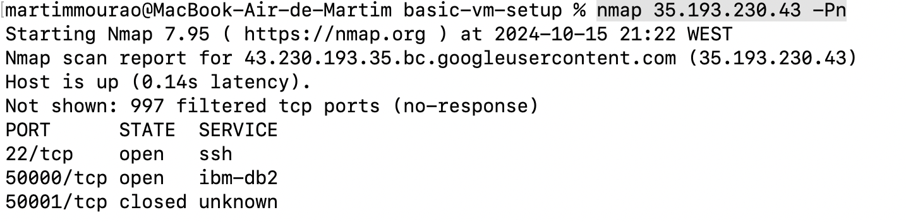
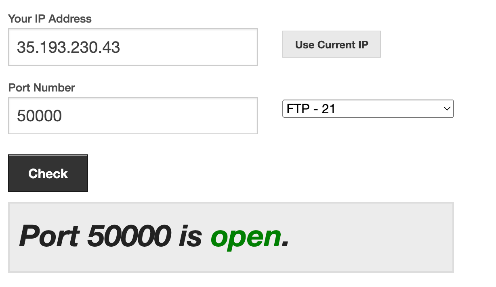

# Basic VM Setup (Debian)

Basic project to setup a VM on Google Cloud Platform. 
Custom firewall rules are created to allow traffic on port 50000.

## Nmap Scan
```
nmap 35.193.230.43 -Pn
```



## Netcat Listener
```
sudo apt install netcat
nc -l -p 50000 -k
```

